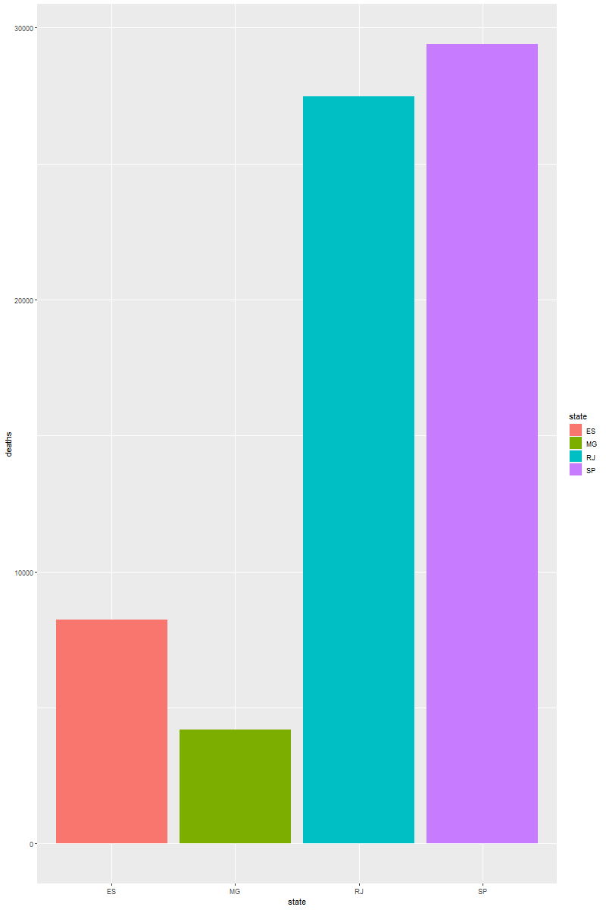
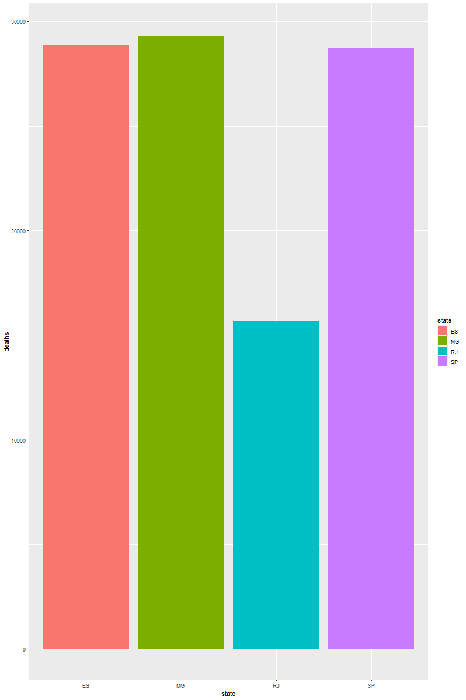
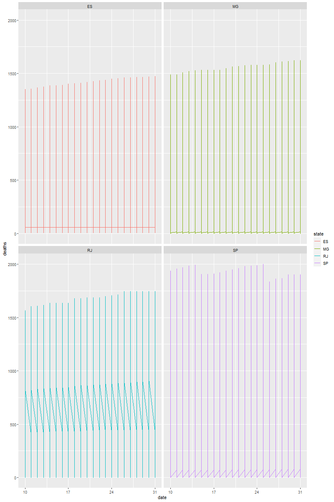

# Códigos das aulas de Ferramentas de modelagem

> Disciplina ofertada pelo programa de pós graduação em Biometria (Unesp - Botucatu)

---

## Trabalho de ferramentas de modelagem

Nesse trabalho analisamos o perfil de distribuição dos óbitos devido a COVID-19, doença ocasionada pelo vírus SARS-CoV-2, em 26 estados brasileiros e no Distrito Federal. Em dois intervalos de tempo distintos: o primeiro, corresponde a um período no qual observou-se um maior número de óbitos causados pela COVID-19, quando a vacinação ainda estava em estágios iniciais (maio de 2021); o segundo refere-se ao período de um ano após o início da vacinação (maio de 2022).

Para entender o perfil de distribuição, realizamos dois tipos de gráficos, o de coluna e de linha

### Segue alguns exemplos do que foi feito:

#### Gráfico de coluna na região Sudeste em 2020

#### Gráfico de linha na região Sudeste em 2020

#### Gráfico de linha na região Sudeste em 2021

#### Gráfico de linha na região Sudeste em 2021

### No fim, um gráfico de distribuição foi realizado, porém, não conseguimos alterar algumas de suas características, então colocaremos ele em forma simbólica

#### Gráfico de distribuição de morte por covid no Brasil em 2020

#### Gráfico de distribuição de morte por covid no Brasil em 2021

